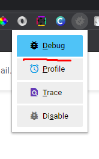
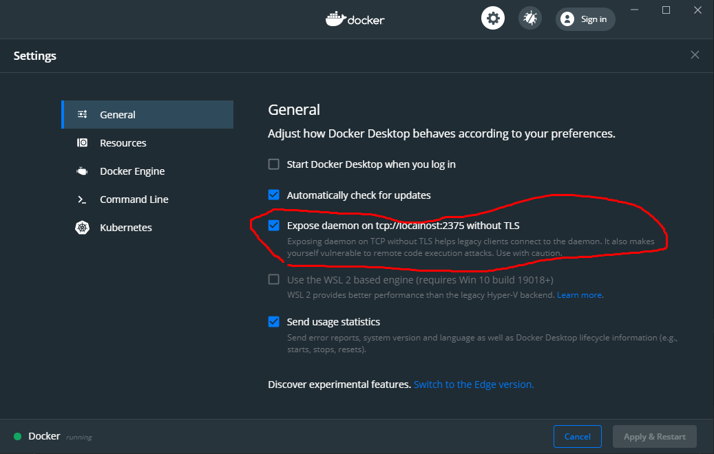
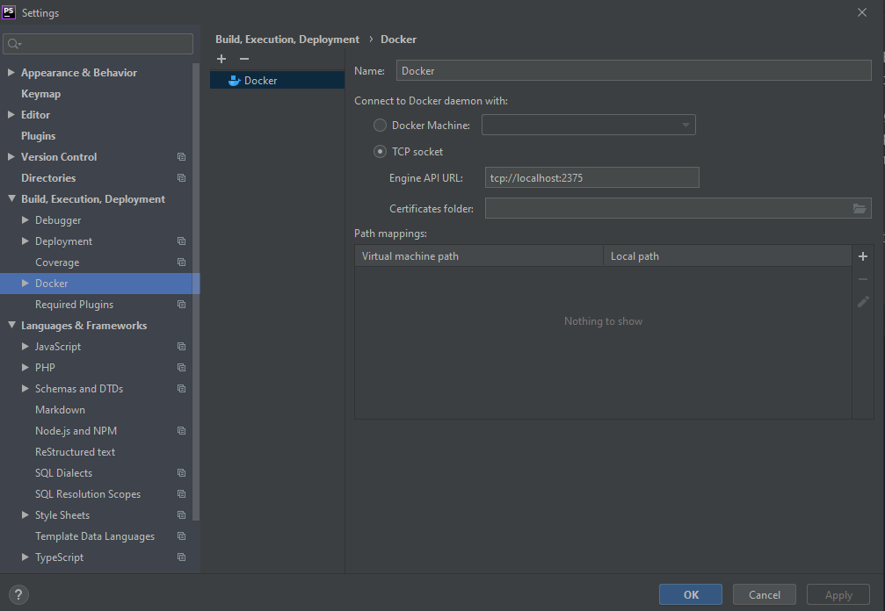
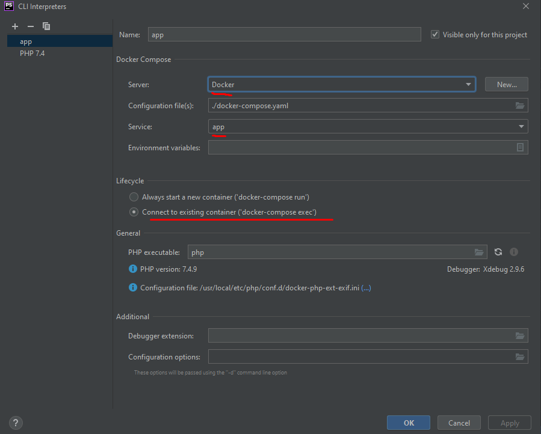
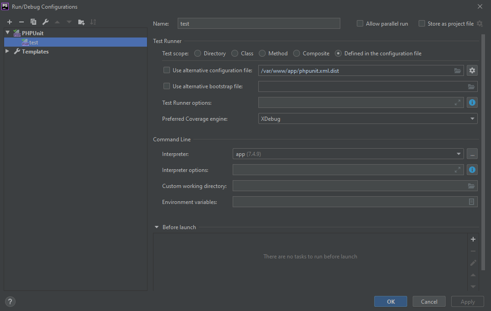
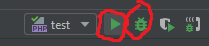

Скажу сразу, с slim framework имею дело впервые.

#### Отладка
Итак, пришлось включить отладку сначала. Думал, что в env файле указав, dev, переключится.
Но данная логика не включена (исправил). Потом заметил, что в файле app.yaml можно включить отладку.

#### Запуска сервера
Была добавлена команда на запуск сервера, необходимо пересобрать контейнер:  
docker-compose build app

docker-compose up  
Скопировать env.example и переименовать в .env  
Войти в container, запустить php сервер (если пересобрали контейнер, то делать это не нужно):  
docker exec -it aspirant-test-issue_app_1 /bin/sh  
php -S 0.0.0.0:8080 -t public

Далее все команды выполняются внутри контейнера.
docker exec -it aspirant-test-issue_app_1 /bin/sh  

#### Проблема с БД
Создание структуры таблиц по схеме:  
php bin/console orm:schema-tool:create

Тестовое задание для PHP-программиста
=====================================

Измените существующий код так, чтобы на главной странице приложения было:

- текущее время и дата;
- название класса контроллера, который отвечает за отображение этой страницы;
- название метода контроллера, который отправляет данные на эту страницу;

##### Все это есть на основной странице

MIDDLE-уровень
--------------

Дополните существующий код так, чтобы:

- в БД приложения были импортированы (с помощью консольной команды) **10 последних записей** (не больше) из [iTunes Movie Trailers](https://trailers.apple.com);
- на главной странице приложения были показаны эти 10 записей. Каждая должна состоять из заголовка трейлера и постера;
- заголовок каждой записи должен быть ссылкой на подробную страницу трейлера. На подробной странице кроме заголовка и постера должно быть описание трейлера и ссылка на источиник, а так же ссылка для возврата к странице списка;

##### Комментарии
Уже есть команда: php bin/console fetch:trailers

Теперь по-умолчанию не более 10 элементов, а не все, как это было раньше.  
Изменил аргументы на опциональные параметры.  
source(s), maxCount(c)  
php bin/console fetch:trailers -c 10

#### Настройка для Xdebug
Port (при изменении порта нужно перезагрузить прослушивание порта)  
   
Server  

Для chrome браузера установить https://chrome.google.com/webstore/detail/xdebug-helper/eadndfjplgieldjbigjakmdgkmoaaaoc  
  
В параметрах расширения IDE key выставить PhpStorm  
Потом поставить точку останова и проверить

Желательно настройки xdebug в отдельный файл переносить и mounted как volume,
чтобы не пришлось пересобирать контейнер по каждому изменению в Dockerfile.  
Плюс host.docker.internal на mac'ах не сработает.

#### Отладка для консоли
php -dxdebug.remote_autostart bin/console fetch:trailers  

#### Запуск тестов из PhpStorm
  
  
  
  
Запустить можем тесты с отладкой и без:  
  

#### Проверка качество кода  
Через PHP CS Fixer: Code | Inspect code  
./vendor/bin/psalm